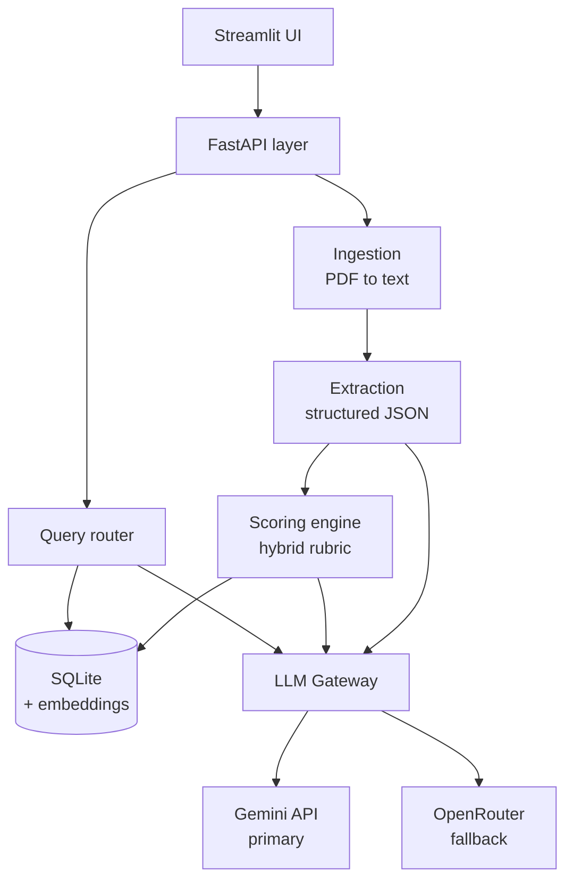
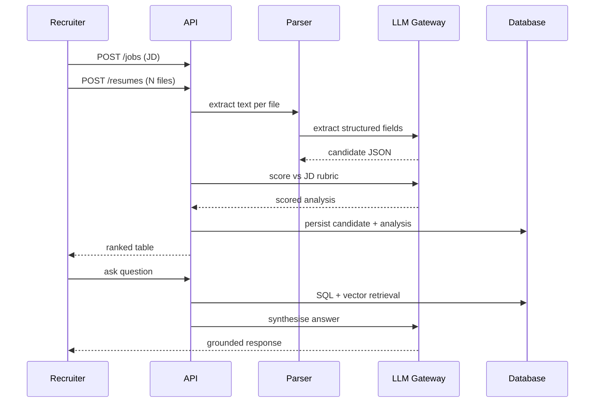
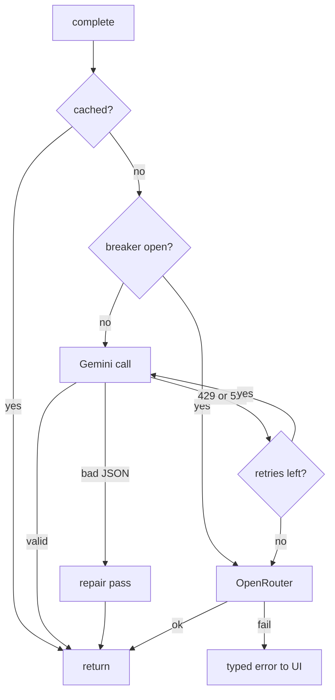
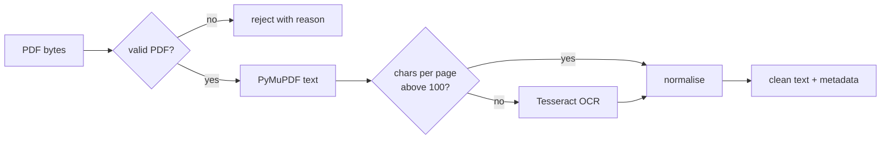
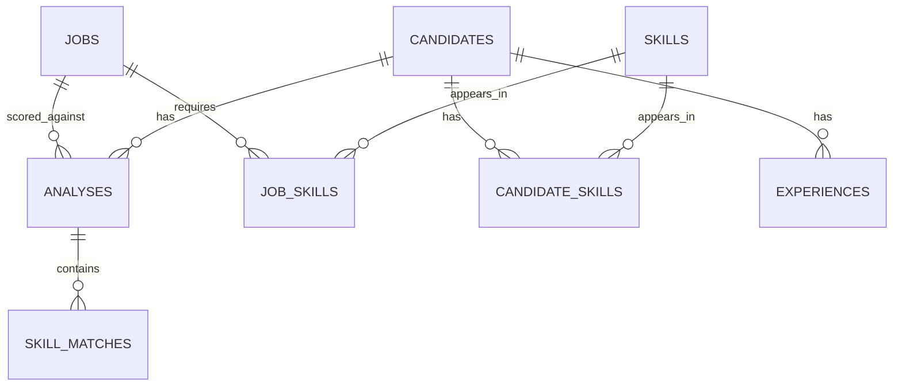
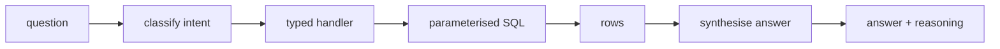

# AI-Powered Recruitment Assistant — Implementation Plan & Spec Sheet

_Last updated 2026-09-18_

## Objectives and definition of done

Build an end-to-end recruitment assistant that ingests resumes and a job description, scores each candidate against that JD with an auditable hybrid rubric, persists the results, and answers recruiter questions in natural language with the reasoning shown.

The assessment grades six areas. Each maps to a concrete artifact in the repository:

| Graded area | Artifact that proves it | Spec section |
| --- | --- | --- |
| AI/ML fundamentals | Hybrid scoring engine, embedding-based skill matching | Scoring methodology |
| Resume parsing | Multi-strategy PDF pipeline with OCR fallback | Ingestion and parsing |
| LLM evaluation | Structured-output analysis with Gemini + OpenRouter fallback | LLM layer |
| Database design | Normalised schema with indexes and migrations | Database schema |
| NL question answering | Intent router over SQL + vector retrieval | Query layer |
| Engineering practice | Tests, typed config, Docker, README | Testing, Configuration |

Done means: a reviewer clones the repo, sets one API key, runs one command, uploads five resumes plus a JD, sees a ranked table within a minute, asks "why is Candidate A above Candidate B" and gets a grounded answer citing specific skills. Everything else is secondary to that path working on a clean machine.

## Assumptions and scope

The brief allows reasonable assumptions provided they are documented. These are the ones the design depends on; every one of them belongs verbatim in the README.

**Assumptions**

1. Resumes are text-bearing PDFs in the common case. Scanned or image-only PDFs are handled by an OCR fallback, but accuracy on them is not guaranteed.
2. Resumes are in English. Non-English resumes will parse but scoring quality degrades.
3. One active job description at a time per session; the schema supports many JDs, the UI surfaces one as "current".
4. A batch is up to 50 resumes. Beyond that the queue still works but the UI is not designed for it.
5. Total years of experience is derived from date ranges in the work-history section, overlapping roles counted once.
6. "Missing skill" means absent from the resume text, not absent from the candidate. The wording in the UI reflects that.
7. No candidate PII leaves the machine except to the chosen LLM provider, which the recruiter selects knowingly.
8. Free-tier LLM quotas are the operating assumption, so the design minimises token spend and caches aggressively.

**In scope**

Upload, parse, extract, score, store, rank, query, compare, export. Single-user local deployment. Both LLM providers wired with automatic failover.

**Out of scope**

Multi-tenant auth, ATS integrations, email outreach, interview scheduling, resume formats other than PDF and plain text, real-time collaborative editing, and horizontal scaling. Each is noted as a limitation rather than silently omitted.

## System architecture

Six layers, each with one job and a typed boundary to the next. The LLM provider sits behind a single gateway so no other module knows whether Gemini or OpenRouter answered.



The gateway is the only module holding provider credentials, which keeps the failover logic in one testable place.

**Sequence of a full ingestion run**



Extraction and scoring are two separate LLM calls rather than one. Splitting them keeps each prompt short, makes the extraction cacheable across job descriptions, and means a scoring rubric change does not force every resume to be re-parsed.

## Technology stack

| Layer | Choice | Why this one |
| --- | --- | --- |
| Language | Python 3.11+ | Best PDF and LLM library coverage; matches the brief's examples |
| API | FastAPI + Uvicorn | Pydantic models give the typed boundaries this design relies on; auto OpenAPI docs are a free deliverable |
| Frontend | Streamlit | Fastest route to a demo-able recruiter UI; no build step for the reviewer |
| Database | SQLite via SQLAlchemy 2.0 | Zero setup for the grader; SQLAlchemy keeps a Postgres switch to one env var |
| Vector store | `sqlite-vec` extension | Keeps embeddings in the same file as the relational data, so there is one artifact to back up and no second service |
| Embeddings | `sentence-transformers` all-MiniLM-L6-v2 | Runs locally on CPU, no API cost, 384 dims, adequate for skill similarity |
| PDF parsing | PyMuPDF primary, `pdfplumber` for tables, `pytesseract` for OCR | PyMuPDF is fastest and most layout-faithful; the other two cover its two weak cases |
| LLM primary | Google Gemini API | Generous free tier, native structured output, large context |
| LLM fallback | OpenRouter | One key reaches many models, so quota exhaustion is not a dead end |
| Validation | Pydantic v2 | Doubles as the LLM response schema and the API contract |
| Testing | pytest + `respx` | Mocks both providers without network access |
| Packaging | `uv` + Docker | Reproducible install; one command to run |

SQLite plus `sqlite-vec` is the load-bearing choice. It removes Postgres and a separate vector database from the setup instructions, which is the single biggest cause of a reviewer failing to run a submitted project.

## LLM layer: Gemini primary, OpenRouter fallback

One module, `llm/gateway.py`, exposes a single method: `complete(prompt, schema, task) -> ParsedModel`. Everything else in the codebase calls only that. Providers, retries, and model choice live behind it.

### Model selection

Model IDs verified against [Google's models page](https://ai.google.dev/gemini-api/docs/models), updated 17 Sep 2026. The current stable Gemini 3 line is `gemini-3.8-flash`, `gemini-3.7-flash`, `gemini-3.6-flash`, `gemini-3.5-flash`, `gemini-3.5-flash-lite` and `gemini-3.1-flash-lite`. Gemini 2.0 Flash and 2.0 Flash-Lite are listed as shut down, so do not hardcode them — much tutorial code still does.

| Task | Model | Why |
| --- | --- | --- |
| Field extraction | `gemini-3.5-flash-lite` | High volume, low reasoning need; cheapest per resume |
| Scoring and analysis | `gemini-3.8-flash` | Judgement-heavy; quality here drives the whole ranking |
| Query answering | `gemini-3.5-flash` | Interactive latency matters more than depth |
| Embeddings | local MiniLM, `gemini-embedding-001` optional | Local by default so the app works with zero quota |

These belong in config, not in code. The `-latest` aliases hot-swap on each release with two weeks' notice of breaking changes, so pin explicit stable IDs and change them in one file.

### API surface choice

Google now recommends the [Interactions API](https://ai.google.dev/gemini-api/docs/migrate-to-interactions) for new development, while `generateContent` remains fully supported. This project uses `generateContent`. The reason is symmetry: OpenRouter speaks OpenAI-style chat completions, and stateless `generateContent` maps onto that with a thin adapter. The Interactions API keeps history server-side via `previous_interaction_id` and returns a typed `steps` timeline, which is real value for agentic flows but has no OpenRouter equivalent and would force two divergent code paths. Record this decision and its trade-off in the README — a defended choice scores better than an undefended default.

### Structured output contract

Every call declares a Pydantic model and gets validated JSON back. The providers express this differently, which is what the gateway hides:

- **Gemini:** `response_mime_type: "application/json"` plus `response_schema` set to the Pydantic class.
- **OpenRouter:** `response_format` carrying a `json_schema` block with the schema, its name and required fields.

Both are generated from one `Model.model_json_schema()` call, so the schema has a single source of truth.

### Failover logic



Rules, in order:

1. **Cache first.** Key on `sha256(prompt + model + schema_version)`. Re-running the same batch costs nothing.
2. **Retry Gemini** on `429 RESOURCE_EXHAUSTED` and 5xx with exponential backoff plus jitter — 1s, 2s, 4s, three attempts max — honouring any `retry-after` header. Per Google's [rate limits page](https://ai.google.dev/gemini-api/docs/rate-limits), limits apply per project rather than per API key and daily quotas reset at midnight Pacific, so a second key on the same project buys nothing.
3. **Trip the breaker** after five consecutive Gemini failures. While open, route straight to OpenRouter for 60 seconds, then half-open with a single probe.
4. **Fall back to OpenRouter.** Default to `google/gemini-3.8-flash` so behaviour stays consistent; OpenRouter's `openrouter/free` router, which selects among currently free models, is the zero-cost last resort.
5. **Repair, don't crash.** Invalid JSON gets one repair pass with the validation error appended to the prompt. Still invalid: return a typed `ExtractionFailed` that the UI renders as a per-candidate error row, never a stack trace.
6. **Log every call** to an `llm_calls` table — provider, model, task, tokens, latency, attempt, outcome. This is the evidence that failover actually works, and it is what a reviewer will look for.

### Token discipline

Free tiers are the design constraint, not an afterthought. Resume text is truncated to roughly 12,000 characters before extraction. The JD is embedded once per session and reused. Extraction output is cached against the resume hash, so changing the JD re-scores without re-parsing. A 50-resume batch should land near 100 LLM calls, comfortably inside a day's free quota.

## Ingestion and parsing

Resume PDFs are the messiest input in the system: two-column layouts, tables used for skills grids, icon glyphs standing in for phone and email, and the occasional scan. The pipeline escalates only as far as it needs to.



**Step 1 — validate.** Check magic bytes, page count under 20, file size under 10 MB, and that the PDF is not encrypted. Reject with a specific message rather than failing downstream.

**Step 2 — extract.** PyMuPDF `page.get_text("blocks")` returns text blocks with bounding boxes. Sorting blocks by column (x-midpoint clustered into bands) then by y-position handles two-column resumes correctly, which naive `get_text()` does not — it interleaves the columns and produces nonsense.

**Step 3 — decide on OCR.** Fewer than 100 extracted characters per page means an image-only PDF. Rasterise at 300 DPI and run Tesseract. This is slow, roughly 2–4 seconds per page, so it runs only on the pages that need it.

**Step 4 — normalise.** Collapse repeated whitespace, fix ligatures and smart quotes, strip headers and footers that repeat on every page, join lines broken mid-sentence, and keep bullet markers since they carry list structure the LLM uses.

**Step 5 — section-tag.** A regex pass labels likely section headings (Education, Experience, Skills, Projects, Certifications) against a synonym list. Tags are hints passed to the extraction prompt, never a hard requirement — a resume with no headings still parses, just less reliably.

The job description takes the same path when uploaded as a PDF, and skips straight to normalisation when pasted as text.

**Fidelity check.** Store `extraction_method` (`pymupdf`, `pymupdf+ocr`) and `char_count` per resume and surface them in the UI. When a candidate scores oddly low, the recruiter can see whether the parse was the problem. This single field turns an opaque failure into a diagnosable one and costs almost nothing to add.

## Candidate analysis contract

Two LLM calls per candidate, each with its own Pydantic schema. Call one is JD-independent and cacheable; call two depends on the JD.

### Call 1 — extraction

```python
class WorkExperience(BaseModel):
    company: str
    title: str
    start_date: str | None   # ISO YYYY-MM where derivable
    end_date: str | None     # None means current
    description: str | None

class Education(BaseModel):
    institution: str
    degree: str | None
    field_of_study: str | None
    graduation_year: int | None

class CandidateExtraction(BaseModel):
    name: str | None
    email: EmailStr | None
    phone: str | None
    location: str | None
    linkedin_url: str | None
    skills: list[str]            # verbatim from the resume, deduped
    experience: list[WorkExperience]
    education: list[Education]
    projects: list[str]
    certifications: list[str]
    total_years_experience: float | None
    extraction_confidence: float  # 0-1, the model's own estimate
```

Rules enforced in the prompt and re-checked in code: never invent a field, return `null` when absent; copy skills verbatim rather than paraphrasing; derive `total_years_experience` from date ranges with overlapping roles counted once.

### Call 2 — JD analysis

```python
class SkillMatch(BaseModel):
    skill: str
    present: bool
    evidence: str | None   # the resume phrase that proves it
    required: bool         # required vs nice-to-have in the JD

class CandidateAnalysis(BaseModel):
    llm_fit_score: int = Field(ge=0, le=100)
    skill_matches: list[SkillMatch]
    strengths: list[str] = Field(max_length=5)
    weaknesses: list[str] = Field(max_length=5)
    summary: str           # 2-3 sentences
    interview_questions: list[str] = Field(min_length=3, max_length=5)
    reasoning: str         # why this score, cited to resume content
```

The `evidence` field is the one that makes the whole system defensible. It forces the model to point at the resume phrase behind each claimed skill, which kills most hallucinated matches and gives the query layer real quotes to cite back to the recruiter.

### Validation after parsing

| Check | Action on failure |
| --- | --- |
| Email matches RFC pattern | Null the field, flag `email_uncertain` |
| Phone has 7–15 digits | Keep raw string, flag `phone_uncertain` |
| `graduation_year` between 1950 and current year + 6 | Null the field |
| Every `evidence` substring appears in the resume text | Set `present = false`, log a hallucination event |
| `total_years_experience` under 60 | Recompute from date ranges |

The evidence-substring check runs with normalised whitespace and case. Counting how often it fires gives an honest hallucination rate to quote in the README — a number most submissions do not have.

## Scoring methodology

The score is a weighted blend of four deterministic components and one LLM judgement. A pure-LLM score is unstable across runs and impossible to explain; a pure-keyword score misses synonyms. The blend is reproducible enough to defend and flexible enough to be useful.

### Formula

```
final_score = round(
    0.35 * required_skill_coverage
  + 0.15 * preferred_skill_coverage
  + 0.20 * experience_fit
  + 0.10 * education_fit
  + 0.20 * llm_fit_score
)
```

All components are on 0–100. Weights live in `config/scoring.yaml` so they can be tuned without touching code, and the version used is stored on every analysis row.

### Components

| Component | How it is computed |
| --- | --- |
| `required_skill_coverage` | Share of JD required skills matched, counting exact matches at 1.0, alias-table matches at 1.0 (`JS` → `JavaScript`), and embedding matches above 0.75 cosine at 0.8 |
| `preferred_skill_coverage` | Same method over the nice-to-have list |
| `experience_fit` | 100 if candidate years ≥ JD minimum; linear from 40 to 100 across the band below it; capped at 100 for large overshoot rather than penalising seniority |
| `education_fit` | 100 if the degree level meets the JD requirement, 70 one level below, 100 when the JD states no requirement |
| `llm_fit_score` | Model's holistic 0–100 judgement, prompted to weigh project relevance and career trajectory — the things the deterministic parts cannot see |

Skill matching runs in that order and stops at the first hit, so cheap exact matching handles most skills and embeddings only run on the remainder.

### Worked example

JD requires Python, FastAPI, Docker, PostgreSQL, ML; prefers AWS, Kubernetes; asks for 3+ years and a Bachelor's.

Candidate A has Python, FastAPI, TensorFlow, scikit-learn, PostgreSQL, 4 years, B.Tech. No Docker.

| Component | Value | Working |
| --- | --- | --- |
| Required coverage | 80 | 4 of 5 (ML matched via TensorFlow at 0.81 cosine); Docker absent |
| Preferred coverage | 0 | Neither AWS nor Kubernetes present |
| Experience fit | 100 | 4 years meets the 3-year minimum |
| Education fit | 100 | B.Tech meets Bachelor's |
| LLM fit | 78 | Strong project relevance, no deployment experience |
| **Final** | **72** | 28.0 + 0.0 + 20.0 + 10.0 + 15.6 |

### Recommendation bands

| Score | Recommendation |
| --- | --- |
| 75–100 | Shortlist |
| 50–74 | Consider |
| 0–49 | Reject |

One override: any candidate missing more than half the required skills is capped at Consider regardless of total, because a high score built entirely on adjacent strengths misleads the recruiter.

Every component value is persisted alongside the total, so the query layer can answer "why is A above B" by differencing components rather than asking the LLM to reconstruct its own reasoning after the fact.

## Database schema

Seven tables. Skills are normalised into their own table rather than stored as a JSON blob, because "which candidates know Python" should be an indexed join, not a string scan across every row.



### Core tables

| Table | Key columns | Notes |
| --- | --- | --- |
| `jobs` | `id`, `title`, `raw_text`, `min_years`, `education_level`, `embedding`, `created_at` | One row per JD |
| `candidates` | `id`, `name`, `email`, `phone`, `location`, `total_years_experience`, `resume_hash`, `extraction_method`, `char_count`, `raw_text`, `created_at` | `resume_hash` unique — re-uploading the same file updates rather than duplicates |
| `skills` | `id`, `canonical_name`, `embedding` | Global vocabulary, deduped across all resumes and JDs |
| `candidate_skills` | `candidate_id`, `skill_id`, `raw_mention`, `evidence` | `raw_mention` keeps the resume's own wording |
| `job_skills` | `job_id`, `skill_id`, `is_required` | Splits required from nice-to-have |
| `experiences` | `id`, `candidate_id`, `company`, `title`, `start_date`, `end_date`, `description` | Enables "more than 2 years at a startup" style queries |
| `analyses` | `id`, `candidate_id`, `job_id`, `final_score`, five component scores, `recommendation`, `summary`, `reasoning`, `strengths`, `weaknesses`, `interview_questions`, `scoring_version`, `created_at` | Unique on (`candidate_id`, `job_id`) |
| `skill_matches` | `analysis_id`, `skill_id`, `present`, `required`, `evidence` | Per-skill detail behind each score |
| `llm_calls` | `id`, `provider`, `model`, `task`, `prompt_tokens`, `completion_tokens`, `latency_ms`, `attempt`, `status` | Audit and cost trail |

### Indexes

```sql
CREATE UNIQUE INDEX idx_cand_hash     ON candidates(resume_hash);
CREATE UNIQUE INDEX idx_analysis_pair ON analyses(candidate_id, job_id);
CREATE INDEX idx_analysis_score       ON analyses(job_id, final_score DESC);
CREATE INDEX idx_cs_skill             ON candidate_skills(skill_id);
CREATE INDEX idx_cs_candidate         ON candidate_skills(candidate_id);
CREATE INDEX idx_exp_candidate        ON experiences(candidate_id);
```

`idx_analysis_score` makes "top 5 candidates" a single index scan, which is the most common query in the whole application.

### Design decisions worth stating in the README

Scores are stored, never recomputed at read time, so a ranking is reproducible even after the scoring weights change — `scoring_version` records which rules produced it. Lists that are only ever read whole (`strengths`, `interview_questions`) are stored as JSON columns; anything that gets filtered or joined is a real table. Embeddings live in `sqlite-vec` virtual tables alongside the relational data, keeping the entire application state in one portable file.

## Natural language query layer

The brief lists ten example questions. They fall into six intents, and routing to a typed handler beats free-form text-to-SQL on every axis that matters here: correctness, latency, token cost, and safety.

### Intent routing

One LLM call classifies the question into an intent plus typed parameters.

| Intent | Example from the brief | Handler |
| --- | --- | --- |
| `top_n` | Show me the top 5 candidates | `ORDER BY final_score DESC LIMIT n` |
| `filter_skill` | Which candidates know Python / are missing Docker | Join through `candidate_skills`, with a `has`/`missing` flag |
| `filter_attribute` | Candidates with more than 2 years of experience | Comparison on a whitelisted numeric column |
| `compare` | Compare Candidate A and Candidate B | Fetch both analyses, diff components |
| `explain_ranking` | Why is X ranked higher than Y | Diff components, narrate the largest gaps |
| `recommend` | Recommend the best candidate for interview | Top-scored plus its reasoning |
| `semantic` | anything else | Embedding search over summaries and evidence |



The classifier returns a Pydantic model, so an unparseable intent falls through to semantic search rather than producing a malformed query.

### Why not text-to-SQL

Generating raw SQL from a schema in the prompt is the obvious approach and the wrong one for a graded submission. It needs the whole schema in every prompt, produces subtly wrong joins on the questions that look easy, and opens an injection surface. Typed handlers cover all ten listed questions with parameterised queries the reviewer can read. Say this in the README — showing you considered the obvious approach and rejected it for reasons is worth more than implementing it.

### Safety guardrails

All SQL is parameterised and built from whitelisted column names. The database connection for the query path is read-only. Result sets are capped at 50 rows before synthesis. The synthesis prompt receives only retrieved rows and is instructed to answer from them alone — if the rows do not contain the answer, it says so instead of guessing.

### Answer synthesis

The final call turns rows into prose with reasoning attached, matching the example in the brief. For `explain_ranking`, the component diff is computed in Python first and passed in as structured facts, so the numbers in the answer are arithmetic rather than LLM recall:

> Candidate A ranks above Candidate B mainly on required-skill coverage, 80 against 60 — A has FastAPI and PostgreSQL, which B lacks. B leads slightly on experience, 6 years against 4, but that component carries less weight. Neither has Docker.

Every answer carries the candidate IDs behind it so the UI can render them as links back to the full profile.

## API specification

Ten endpoints. FastAPI generates OpenAPI docs at `/docs`, which doubles as an API deliverable for the README at no extra cost.

| Method | Path | Purpose |
| --- | --- | --- |
| `POST` | `/api/jobs` | Create a job from PDF upload or pasted text |
| `GET` | `/api/jobs/{id}` | Job detail with parsed required and preferred skills |
| `POST` | `/api/jobs/{id}/resumes` | Upload 1-50 PDFs, returns a batch id |
| `GET` | `/api/batches/{id}` | Poll batch progress: per-file status and errors |
| `GET` | `/api/jobs/{id}/candidates` | Ranked list; supports `min_score`, `skill`, `limit` |
| `GET` | `/api/candidates/{id}` | Full profile plus analysis for the current job |
| `POST` | `/api/jobs/{id}/query` | Natural language question, returns answer and sources |
| `POST` | `/api/jobs/{id}/rescore` | Re-run scoring with current weights, no re-parse |
| `GET` | `/api/jobs/{id}/export` | CSV or XLSX of the ranked table |
| `GET` | `/api/health` | Provider reachability and breaker state |

### Query response shape

A `POST` to the query endpoint takes a single `question` field. The response carries:

| Field | Type | Meaning |
| --- | --- | --- |
| `answer` | string | Recruiter-facing prose with reasoning |
| `intent` | enum | Which handler ran, useful for debugging |
| `sources` | array | Candidate id, name and score behind the answer |
| `latency_ms` | int | End-to-end time |
| `provider_used` | enum | `gemini` or `openrouter`, so failover is visible |

Returning `sources` and `provider_used` rather than bare prose is what lets the UI link each claim back to a profile and show the recruiter which provider answered.

### Processing model

Upload returns immediately with a batch id; parsing and scoring run in a FastAPI `BackgroundTasks` worker behind a semaphore of four concurrent LLM calls, tuned to stay under free-tier per-minute limits. The UI polls the batch endpoint every two seconds. One failed resume never blocks the batch — it appears as a per-file error with its reason.

### Errors

| Status | Code | When |
| --- | --- | --- |
| 400 | `INVALID_PDF` | Corrupt, encrypted, or over 20 pages |
| 413 | `FILE_TOO_LARGE` | Over 10 MB |
| 422 | `EXTRACTION_FAILED` | Both providers returned unparseable output |
| 429 | `QUOTA_EXHAUSTED` | Gemini and OpenRouter both rate-limited |
| 503 | `NO_PROVIDER` | No API key configured, or both unreachable |

Every error body carries a code, a human-readable message, and `retry_after` where it applies. The UI renders the message directly, so error copy is written for recruiters rather than developers.

## Frontend specification

Four Streamlit pages sharing one sidebar that shows the active job, candidate count, and a provider status dot.

**1. Setup.** Paste or upload the JD. Shows the parsed required and preferred skills as editable chips — the recruiter can correct a mis-parsed requirement before any scoring runs, which is cheaper than re-scoring afterwards. Drag-and-drop resume upload with a running file list.

**2. Processing.** Live table, one row per file: filename, status, extraction method, error if any. A progress bar and a running count of LLM calls made. Failures stay visible with a retry button rather than vanishing.

**3. Candidates.** The main view. Sortable table of name, score, recommendation, matched and missing skill counts, years. Score cell is colour-banded by recommendation. Expanding a row reveals the component breakdown, strengths and weaknesses, summary, evidence-linked skill list, and suggested interview questions. Filters for minimum score, required skill, and years. Export button.

**4. Assistant.** Chat interface. Each answer renders prose plus source chips linking to candidate rows, with the provider used shown in small text. Four of the brief's example questions appear as starter buttons so a reviewer can demo it without typing.

### States that must be handled

No job yet, job but no resumes, batch in progress, all resumes failed, no API key configured, quota exhausted mid-batch. Each gets a specific message and a next action. Empty states are where demo apps fall over in front of a reviewer, and they cost an hour to do properly.

## Implementation plan

Seven phases, roughly 40 hours of focused work. Each ends in something demonstrable, so an interrupted build still has a working subset rather than a half-wired skeleton.

| Phase | Hours | Ships | Done when |
| --- | --- | --- | --- |
| 0. Skeleton | 2 | Repo, `uv` deps, typed config, SQLAlchemy models, Alembic migration, `/api/health` | `docker compose up` serves health |
| 1. Gateway | 5 | Gemini client, OpenRouter client, retry, breaker, cache, `llm_calls` logging | Unit tests pass with both providers mocked; forcing Gemini to 429 falls through to OpenRouter |
| 2. Parsing | 5 | PyMuPDF pipeline, column ordering, OCR fallback, normalisation, section tagging | Ten varied sample resumes extract cleanly; one scanned PDF goes through OCR |
| 3. Extraction | 5 | Extraction prompt, Pydantic schemas, validators, evidence check, persistence | Ten resumes land in the DB with correct names and emails |
| 4. Scoring | 6 | JD parsing, skill normalisation, embeddings, five components, bands, rescore endpoint | Worked example from this doc reproduces to the point |
| 5. Query layer | 6 | Intent classifier, six handlers, semantic fallback, synthesis | All ten example questions from the brief answer correctly |
| 6. UI | 6 | Four Streamlit pages, polling, empty states, export | End-to-end demo from cold start |
| 7. Hardening | 5 | Tests, README, architecture diagram, seed data, Docker | Clean clone runs in under five minutes |

### Build order rationale

The gateway comes before anything that calls an LLM, so every later phase gets retry and caching for free and no prompt work is ever lost to a quota error. Parsing precedes extraction because extraction quality is bounded by parse quality — tuning prompts against badly extracted text wastes a day. Scoring precedes the query layer because the query layer reads scores.

### Critical path and the trap

Phases 1 through 4 are sequential; 5 and 6 can overlap if time is short. The usual failure mode on this assignment is spending fifteen hours on prompt tuning and shipping without the README, tests, or a clean-clone check. Phase 7 is not optional padding — the brief lists documentation as a graded deliverable with ten required sections, and it is the cheapest marks in the whole assignment.

### Commit discipline

One commit per meaningful unit with a conventional-commit message, a tag at each phase boundary. The reviewer reads the commit history as evidence of engineering practice; a single "initial commit" containing everything reads badly regardless of code quality.

## Testing and evaluation

Tests run with no network access and no API key. Both providers are mocked with `respx`, so `pytest` passes on a fresh clone — which is exactly what a reviewer will try.

| Layer | What is tested | Tool |
| --- | --- | --- |
| Parsing | Ten fixture PDFs including two-column, scanned, and table-heavy layouts; asserts on expected substrings | pytest |
| Gateway | Retry counts, breaker transitions, failover path, cache hits, repair pass | `respx` with scripted 429s |
| Schemas | Malformed LLM output, missing fields, out-of-range scores | Pydantic round-trip |
| Scoring | Worked example reproduces exactly; weight changes move scores as expected | pytest parametrised |
| Query | All ten brief questions against a seeded DB, asserting intent and row set | pytest |
| Integration | Full upload-to-answer path with mocked LLM | FastAPI `TestClient` |

### Evaluation set

Build a small golden set: one JD and twelve resumes with hand-labelled expected extractions and a human ranking. Report three numbers in the README:

- **Field extraction accuracy** — per-field exact match against labels, reported separately for name, email, phone, skills.
- **Hallucination rate** — share of claimed skills whose evidence string is not in the resume text.
- **Ranking correlation** — Spearman correlation between system ranking and the human ranking.

Twelve resumes is a small set and the numbers carry wide error bars. Say so. A stated limitation reads as rigour; an unqualified accuracy claim on twelve samples reads as naivety.

### Quality gates

`ruff` for lint, `mypy --strict` on the `llm` and `scoring` packages where the type discipline actually pays, `pytest --cov` with a 70% floor on business logic. A GitHub Actions workflow runs all three on push — visible CI badges are cheap evidence of engineering practice.

## Configuration and repository layout

### Environment

```
GEMINI_API_KEY=            # required for the primary path
OPENROUTER_API_KEY=        # optional; without it there is no fallback
GEMINI_MODEL_EXTRACT=gemini-3.5-flash-lite
GEMINI_MODEL_ANALYZE=gemini-3.8-flash
GEMINI_MODEL_QUERY=gemini-3.5-flash
OPENROUTER_MODEL=google/gemini-3.8-flash
DATABASE_URL=sqlite:///./data/recruiter.db
EMBEDDING_BACKEND=local    # local | gemini
MAX_CONCURRENT_LLM=4
LOG_LEVEL=INFO
```

All of it is validated at startup by a Pydantic `Settings` class. A missing `GEMINI_API_KEY` fails fast with a message naming the variable and where to get a key — not a `KeyError` three layers deep. Ship a `.env.example` with every variable and no values, and keep `.env` in `.gitignore`. A leaked key in git history is the single most damaging thing that can happen to this submission.

### Layout

```
app/
  api/          routes, dependencies, error handlers
  llm/          gateway, gemini.py, openrouter.py, prompts/
  parsing/      pdf.py, ocr.py, normalise.py, sections.py
  extraction/   schemas.py, extractor.py, validators.py
  scoring/      components.py, engine.py, skills.py
  query/        classifier.py, handlers/, synthesis.py
  db/           models.py, session.py, migrations/
  ui/           streamlit pages
config/scoring.yaml
tests/          fixtures/ with sample PDFs
docs/architecture.md
README.md
docker-compose.yml
```

Prompts live as versioned text files under `llm/prompts/`, not as inline f-strings. Diffing a prompt change in git is worth the small extra indirection, and it lets the README point at the actual prompts.

### Running it

`docker compose up` is the documented path, with `uv sync && uv run uvicorn app.main:app` as the local alternative. Both belong in the README. A `make seed` target loads the sample JD and twelve fixture resumes, so a reviewer sees a populated ranking table within a minute of cloning — before they have found an API key of their own. That single command probably moves the grade more than any individual feature.

## Limitations and risks

### Known limitations, for the README

1. Scanned resumes depend on OCR quality; heavily designed or handwritten documents may extract poorly.
2. Non-English resumes parse but score unreliably.
3. Skill matching relies on the alias table plus embeddings, so a rare technology named only once may be missed.
4. Years of experience is inferred from dates and is wrong when a resume omits them or lists overlapping contracts ambiguously.
5. The LLM component of the score varies slightly between runs even at temperature 0. The deterministic 80% keeps rankings stable.
6. Single-user, single-machine. No auth, no concurrent-writer safety.
7. The evaluation set is twelve resumes. Reported accuracy has wide error bars.

### Build risks

| Risk | Mitigation |
| --- | --- |
| Free-tier quota exhausted mid-build | Cache every call from day one; OpenRouter as second key; fixture-mocked tests need no quota |
| Model ID deprecated between build and review | All IDs in config, README names the date they were verified |
| Two-column resumes parse as interleaved nonsense | Column-aware block sorting in phase 2, tested against fixtures |
| Prompt tuning eats the schedule | Timebox phase 3 to five hours; ship a working pipeline over a perfect prompt |
| Reviewer cannot run it | `make seed` plus mocked tests make a clean clone demonstrable without any key |

### Fairness

Resume screening tools can encode bias, and a reviewer may well probe this. Three concrete measures, each cheap:

Name, gender markers, age, photo and address are excluded from the scoring prompt — extracted for display, withheld from judgement. The prompt explicitly instructs the model to score on skills, experience and education alone. And every score decomposes into named components with evidence, so a recruiter can audit any ranking rather than trusting a number.

State plainly in the README that the tool ranks resumes to assist a human decision and is not a hiring decision system. That framing is correct, and it is the kind of judgement that distinguishes a considered submission.

## README checklist

The brief names ten required README sections. Each maps to a section of this spec, so the README is largely an edit rather than a write.

| Required section | Source | Status |
| --- | --- | --- |
| Project description and objectives | Objectives | Draft from this doc |
| System architecture explanation | System architecture, both diagrams | Draft from this doc |
| Setup and installation | Configuration, Running it | Write during phase 7 |
| Resume parsing approach and library choices | Ingestion and parsing | Draft from this doc |
| Candidate scoring logic and methodology | Scoring methodology, with the worked example | Draft from this doc |
| Database schema overview | Database schema, ER diagram | Draft from this doc |
| NL query handling approach | Query layer, including why not text-to-SQL | Draft from this doc |
| How to run the application | Running it | Write during phase 7 |
| Assumptions made | Assumptions, all eight verbatim | Draft from this doc |
| Known limitations | Limitations, all seven | Draft from this doc |

### Extras worth adding

A short demo GIF of upload through to a chat answer, placed at the top. The evaluation numbers from the golden set. A one-paragraph note on the Gemini-plus-OpenRouter design and why failover was built rather than assumed. A table of the ten brief questions with the actual answers the system returns — it proves the requirement is met without the reviewer having to run anything.

The architecture diagram the brief lists as optional takes ten minutes as a Mermaid block and lands directly in the README.
