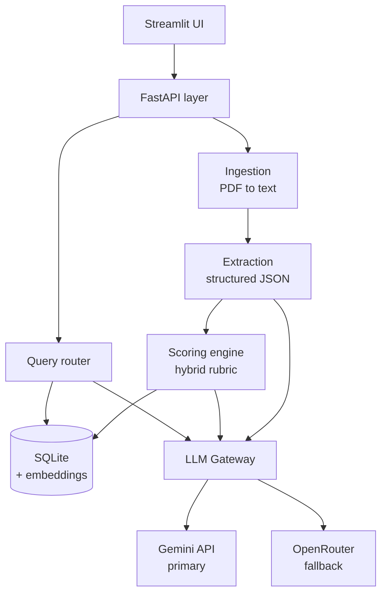
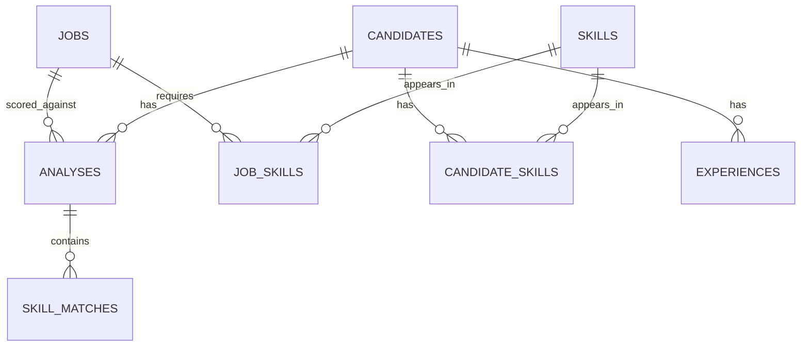

# NipunyaMatch

[](https://github.com/DNSdecoded/NipunyaMatch/actions/workflows/ci.yml)


[](LICENSE)
[](https://ai.google.dev/)
[](https://openrouter.ai/)
[](https://deepwiki.com/DNSdecoded/NipunyaMatch)

Local, single-user recruitment assistant: upload resume PDFs and one job description, get an
auditable ranked table, and ask questions in plain English with cited reasoning.

## Demo

<video src="https://github.com/DNSdecoded/NipunyaMatch/releases/download/v0.7/demo.mp4" controls muted playsinline width="100%"></video>


**Live demo:** https://nipunyamatch-538602735799.us-central1.run.app — bring your own free
Gemini key (sidebar). Cold start after idle takes ~1–3 min (the API seeds itself behind the UI).
Data is shared between visitors and resets on restart; deletes are disabled there.

20-second walkthrough: ranked candidates → score breakdown → evidence check → grounded Q&A.
[MP4 (release asset)](https://github.com/DNSdecoded/NipunyaMatch/releases/download/v0.7/demo.mp4) · [MP4 (repo)](docs/media/demo.mp4)

## 1. Project description and objectives

**Goal.** Ingest resumes (PDF/text) and one job description, score each candidate with an
auditable hybrid rubric, persist results, and answer recruiter questions in natural language with
reasoning and sources.

**Definition of done.** Clone → set one API key → one command → upload five resumes + JD → ranked
table within a minute → ask "why is A above B" → grounded answer citing specific skills. All on a
clean machine.

## 2. System architecture



Six layers, each with a Pydantic boundary. `app/llm/gateway.py` is the only module that knows a
provider exists. More diagrams in [`docs/architecture.md`](docs/architecture.md); contracts in
[`docs/specs.md`](docs/specs.md).

**`generateContent` vs the Interactions API.** The gateway calls Gemini's stateless
`generateContent` endpoint rather than the stateful Interactions API. Trade-off: no server-side
conversation memory (not needed; every call is a one-shot structured extraction), in exchange for
one adapter shape that Gemini and OpenRouter's chat-completions both fit, which is what makes
failover a swap of URL and body rather than a second code path.

**Failover, with evidence.** `complete()` runs cache → Gemini with 1s/2s/4s retry on 429/5xx →
circuit breaker (5 consecutive failures opens it for 60s, then one probe) → OpenRouter → one JSON
repair pass → typed error. Every attempt is written to the `llm_calls` table (provider, model,
task, tokens, latency, attempt, status), so the audit trail — not a log line — is the evidence of
which provider answered and how many retries it took.

## 3. Setup and installation

### Prerequisites

| Need | Why | Install |
| --- | --- | --- |
| Python 3.11+ | runtime | python.org, or let `uv` fetch one |
| `uv` (recommended) | dependency manager, lockfile | `pipx install uv` / `winget install astral-sh.uv` / `brew install uv` |
| Gemini API key | the only required credential | free at https://aistudio.google.com/apikey |
| Tesseract (optional) | OCR for scanned resumes only | `apt install tesseract-ocr` · `brew install tesseract` · `winget install UB-Mannheim.TesseractOCR` |
| Docker (optional) | containerised run / deploy | Docker Desktop or Engine |

First run downloads the `all-MiniLM-L6-v2` embedding model (~90 MB) into the Hugging Face cache;
the Docker image bakes it in.

### Configure

```bash
git clone https://github.com/DNSdecoded/NipunyaMatch.git && cd NipunyaMatch
cp .env.example .env
# edit .env: set GEMINI_API_KEY=...   (everything else has a working default)
```

`.env` keys:

| Variable | Default | Meaning |
| --- | --- | --- |
| `GEMINI_API_KEY` | — | required; startup fails with a named error without it |
| `OPENROUTER_API_KEY` | empty | optional second provider; without it there is no cross-provider fallback |
| `GEMINI_MODEL_EXTRACT` / `_ANALYZE` / `_QUERY` | `gemini-3.5-flash-lite` / `gemini-3.8-flash` / `gemini-3.5-flash` | model per task |
| `GEMINI_MODEL_FALLBACK` | `gemini-3.5-flash-lite` | tried when a task's model exhausts retries (free-tier quotas are per model) |
| `OPENROUTER_MODEL` | `google/gemini-3.8-flash` | fallback provider's model |
| `DATABASE_URL` | `sqlite:///./data/recruiter.db` | any SQLAlchemy URL; SQLite file is created on first run |
| `MAX_CONCURRENT_LLM` | `4` | semaphore around LLM calls during batch processing; use `1` on the free tier |
| `DEMO_MODE` | `false` | public-demo hardening (see §8) |
| `LOG_LEVEL` | `INFO` | |

### Install — pick one

**A. `uv` (recommended, reproducible from `uv.lock`)**

```bash
uv sync                 # creates .venv with exact pinned versions, dev tools included
```

**B. plain `pip` / `venv`**

```bash
python -m venv .venv
. .venv/bin/activate            # Windows: .venv\Scripts\activate
pip install -r requirements.txt # runtime pins exported from uv.lock
pip install -e .                # puts the `app` package on the path (needed by scripts/)
```

For tests/lint on the pip path also `pip install pytest pytest-asyncio pytest-cov respx ruff mypy types-PyYAML`.

**C. Docker only** — nothing to install locally beyond Docker; see §8.

### Verify

```bash
uv run pytest -q                # 157 tests, no network, no key needed
uv run ruff check . && uv run mypy app/llm app/scoring
```

(Prefix with `.venv/bin/` or activate the venv instead of `uv run` on the pip path.)

### Free-tier notes

The Gemini free tier allows roughly 20 requests/day *per model* and sometimes returns `503` on
busy models. Budget: 1 call per JD, 2 per resume (extract + analyse), 2 per chat turn. Extractions
and analyses are cached by prompt hash, so re-uploading a batch only re-runs what failed. If you
see `429 QUOTA_EXHAUSTED … retry in Ns`, either wait, point the task at another model in `.env`,
or add `OPENROUTER_API_KEY` (an OpenRouter account with no credits answers `402`, reported as
`QUOTA_EXHAUSTED` too). Model IDs live in `.env`, never in code; Gemini 2.0 models are shut down
and are not used.

## 4. Resume parsing approach and library choices

Pipeline (`app/parsing/`): validate (`%PDF` magic, <20 pages, <10 MB, not encrypted; each failure
has a recruiter-facing message) → PyMuPDF text → per-page OCR only when a page has <100 characters
→ normalise (ligatures, smart quotes, repeated headers/footers, mid-sentence line breaks, bullets
kept) → section tagging (Education/Experience/Skills/Projects/Certifications via a synonym list;
hints only).

Library choices: **PyMuPDF** for text and rasterising (fast, gives span coordinates), **pytesseract**
for OCR at 300 DPI, **Pillow** to hand pixmaps to Tesseract. `pdfplumber` is not wired in; PyMuPDF
spans handled every fixture, and it is one function to add when a table-heavy resume fails.

Two-column resumes: PyMuPDF merges same-baseline text across columns into one block, so the parser
splits at span level, clusters spans into column bands by x-midpoint, and reads each band top to
bottom. `extraction_method` (`pymupdf` | `pymupdf+ocr`) and `char_count` are stored per candidate
and shown in the UI so a recruiter can see when a resume was OCR'd.

## 5. Candidate scoring logic and methodology

```
final_score = round(
    0.35 * required_skill_coverage
  + 0.15 * preferred_skill_coverage
  + 0.20 * experience_fit
  + 0.10 * education_fit
  + 0.20 * llm_fit_score
)
```

All components 0–100; weights in `config/scoring.yaml`; `scoring_version` stored on every analysis
row; scores are stored, never recomputed at read time.

| Component | Computation |
| --- | --- |
| `required_skill_coverage` | Share of JD required skills matched. Exact = 1.0; alias table (`config/skill_aliases.yaml`, e.g. `JS` → `JavaScript`) = 1.0; embedding cosine > 0.75 = 0.8. Stop at first hit. |
| `preferred_skill_coverage` | Same over the nice-to-have list |
| `experience_fit` | 100 if years ≥ JD minimum; linear 40→100 below; no seniority penalty |
| `education_fit` | 100 if degree level meets requirement; 70 one level below; 100 if JD states none |
| `llm_fit_score` | Model's holistic 0–100 on project relevance and trajectory |

Bands: 75–100 Shortlist, 50–74 Consider, 0–49 Reject. Override: missing more than half the
required skills caps the recommendation at Consider.

**Worked example** (reproduced exactly by `tests/scoring/test_engine.py::test_worked_example_reproduces`).
JD: required Python, FastAPI, Docker, PostgreSQL, ML; preferred AWS, Kubernetes; 3+ years;
Bachelor's. Candidate: Python, FastAPI, TensorFlow, scikit-learn, PostgreSQL; 4 years; B.Tech.

| Component | Value | Working |
| --- | --- | --- |
| Required coverage | 76 | Python, FastAPI, PostgreSQL exact (3.0) + ML via TensorFlow at 0.81 cosine (0.8) + Docker absent (0) = 3.8 / 5 |
| Preferred coverage | 0 | Neither AWS nor Kubernetes |
| Experience fit | 100 | 4 ≥ 3 |
| Education fit | 100 | B.Tech meets Bachelor's |
| LLM fit | 78 | |
| **Final** | **72** | 26.6 + 0 + 20 + 10 + 15.6 = 72.2 → Consider |

The 20% LLM component varies slightly between runs even at temperature 0; the deterministic 80%
keeps rankings stable.

**Evidence check.** Every skill the model claims must quote a phrase that is a substring of the
resume text (whitespace and case normalised). If it is not, `present` is flipped to false and a
hallucination event is logged. **Fairness:** name, email, phone, location and LinkedIn URL are
extracted for display but withheld from the scoring prompt, which is instructed to judge skills,
experience and education only. This tool assists a human decision; it is not a hiring decision
system.

## 6. Database schema overview



Tables: `jobs`, `candidates` (unique `resume_hash`; re-upload updates in place), `skills` (global
deduped vocabulary), `candidate_skills`, `job_skills`, `experiences`, `analyses` (unique
`(candidate_id, job_id)`; one row per candidate per JD with all five components), `skill_matches`,
`llm_calls` (audit), `llm_cache` (sha256 of prompt+model+schema version → response),
`chat_turns` (persisted assistant conversation per job: question, answer, intent, provider, sources).

Indexes: `idx_cand_hash`, `idx_analysis_pair`, `idx_analysis_score (job_id, final_score)`,
`idx_cs_skill`, `idx_cs_candidate`, `idx_exp_candidate`.

Policy: lists only ever read whole (`strengths`, `weaknesses`, `interview_questions`) are JSON
columns; anything filtered or joined is a table. Embeddings are stored as float32 BLOBs and
compared with numpy cosine — `sqlite-vec` is deferred until candidate counts pass ~1k. Schema is
created with `create_all`; Alembic arrives with the first migration on a live DB.

## 7. NL query handling approach

One LLM call classifies the question into an intent with typed parameters; a typed handler runs
parameterised SQL. **Not text-to-SQL**: the model never writes SQL, so it cannot write a bad
`WHERE`, hallucinate a column, or read a table it should not.

| Intent | Example | Handler |
| --- | --- | --- |
| `top_n` | Show me the top 5 candidates | `ORDER BY final_score DESC LIMIT n` |
| `filter_skill` | Who knows Python / has ML experience / is missing Docker | Join `candidate_skills`; skill name resolved through the alias table (`ML` = `Machine Learning`) |
| `filter_attribute` | More than 2 years experience | Comparison on a whitelisted column |
| `compare` | Compare A and B | Fetch both analyses, diff components |
| `explain_ranking` | Why is X above Y | Diff components, narrate largest weighted gaps |
| `recommend` | Who should we interview | Top-scored + reasoning |
| `semantic` | anything else | Embedding search over summaries |

Guardrails: all SQL parameterised, column names whitelisted, `PRAGMA query_only` on the connection
for the duration of the handler, result sets capped at 50 rows, and the synthesis prompt receives
only retrieved rows plus Python-computed facts (score gaps, per-component diffs, skill set
differences) — numbers in the answer are arithmetic, not model recall. Every answer carries
candidate IDs as sources.

### API surface

| Method | Path | Purpose |
| --- | --- | --- |
| `POST` | `/api/jobs` | Create job from pasted text (`text` form field) or PDF (`file`) |
| `GET` | `/api/jobs` | List jobs (newest first) |
| `GET` | `/api/jobs/{id}` | Job with parsed required/preferred skills |
| `DELETE` | `/api/jobs/{id}` | Delete job and its analyses |
| `POST` | `/api/jobs/{id}/resumes` | Upload 1–50 PDFs → `batch_id` (processing in background) |
| `GET` | `/api/batches/{id}` | Per-file status, extraction method, error, LLM call count |
| `GET` | `/api/jobs/{id}/candidates` | Ranked rows; `min_score`, `skill`, `limit` |
| `GET` | `/api/candidates/{id}` | Full profile, components, evidence-linked skills, questions |
| `GET` | `/api/candidates` | Every candidate in the DB across jobs |
| `DELETE` | `/api/candidates/{id}` | Delete one candidate (resume, skills, analyses) |
| `DELETE` | `/api/candidates` | Clear all candidates |
| `POST` | `/api/jobs/{id}/query` | NL question → answer, intent, sources, provider; turn saved to `chat_turns` |
| `GET` | `/api/jobs/{id}/chat` | Conversation history for the job, oldest first |
| `POST` | `/api/jobs/{id}/rescore` | Re-run deterministic scoring with current weights, no LLM |
| `GET` | `/api/jobs/{id}/export` | `?format=csv` or `xlsx` |
| `GET` | `/api/health` | Provider configuration and breaker state |

Errors are always `{code, message, retry_after}`: `INVALID_PDF` 400, `FILE_TOO_LARGE` 413,
`TOO_MANY_FILES` 400, `NOT_FOUND` 404, `EXTRACTION_FAILED` 422, `QUOTA_EXHAUSTED` 429,
`NO_PROVIDER` 503. Interactive docs at `http://localhost:8000/docs`.

### UI pages

Sidebar on every page: provider status dot, breaker state, **Active job** picker, candidate count.

1. **Setup** — paste or upload a JD, review parsed skills, drag-and-drop resumes.
2. **Processing** — live per-file table polling every 2 s; failures stay visible with the reason.
3. **Candidates** — sortable ranked table, filters, expandable breakdown with evidence quotes,
   CSV/XLSX export.
4. **Assistant** — chat with four starter questions; answers carry source chips and the provider.
   History is stored per job and survives page refresh and restarts.
5. **Data** — everything in the local DB across jobs; delete a job, a candidate, or clear all.

## 8. How to run

Two processes: the FastAPI backend on **:8000** and the Streamlit UI on **:8501** (the UI talks
to the API over HTTP; `API_BASE_URL` tells it where). Pick a path.

### 8.1 Locally without Docker

```bash
# terminal 1 — API
uv run uvicorn app.main:app --reload --port 8000        # make dev
# terminal 2 — UI
uv run streamlit run app/ui/Home.py                     # make ui
```

Open http://localhost:8501. Docs for the raw API: http://localhost:8000/docs.

Optional, before first use — a populated demo without spending any LLM calls:

```bash
GEMINI_API_KEY=dummy uv run python scripts/seed.py      # make seed: 12 fixture resumes, ranked
```

On the pip/venv path replace `uv run` with the activated venv (`python -m uvicorn …`,
`streamlit run …`). Windows without `make`: run the `uv run …` lines directly.

### 8.2 Locally with Docker Compose

```bash
docker compose up --build            # api on :8000, ui on :8501; data/ is bind-mounted
```

Uses your `.env`. The image includes Tesseract and the embedding model, so scanned resumes work
out of the box. Stop with `docker compose down`; the SQLite file persists in `./data`.

### 8.3 Single container (what the hosted demo runs)

```bash
docker build -t nipunyamatch .
docker run --rm -p 8080:8080 --env-file .env nipunyamatch
```

`entrypoint.sh` runs the API on 127.0.0.1:8000 and Streamlit on `$PORT` (8080) in one
container; the demo DB is seeded at build time so a cold instance answers immediately. Add
`-e DEMO_MODE=true` to get the public-demo behaviour below.

### 8.4 Deploy to Google Cloud Run (free tier)

One-time:

```bash
gcloud auth login
gcloud projects create <project> && gcloud config set project <project>
gcloud billing projects link <project> --billing-account <ACCOUNT_ID>   # required, stays $0 at demo traffic
gcloud services enable run.googleapis.com cloudbuild.googleapis.com artifactregistry.googleapis.com
# new projects: give Cloud Build's service account its roles (once)
SA=$(gcloud projects describe <project> --format='value(projectNumber)')-compute@developer.gserviceaccount.com
for r in roles/cloudbuild.builds.builder roles/storage.objectViewer roles/artifactregistry.writer roles/logging.logWriter; do
  gcloud projects add-iam-policy-binding <project> --member serviceAccount:$SA --role $r; done
```

Every deploy (Cloud Build builds the image remotely; ~20 min the first time, no local Docker needed):

```bash
GCP_PROJECT=<project> sh scripts/deploy.sh
```

The script pins the settings that matter for this app: `--cpu 2 --concurrency 80` (Streamlit
WebSockets), `--no-cpu-throttling` (background resume batches keep running after the upload
response), `--timeout 3600 --session-affinity` (long-lived UI sessions), `--max-instances 1`
(SQLite lives inside the instance; it resets on redeploy), `DEMO_MODE=true`. It prints the
service URL at the end.

**Demo mode** (`DEMO_MODE=true`): every LLM-backed call needs an `X-Gemini-Key` header — the
sidebar collects the visitor's key and keeps it in the browser session only, so the server key
is never spent; deletes and rescoring are disabled (`403 DEMO_READ_ONLY`); uploads are capped at
10 files / 5 MB each. Data is shared between visitors.

### 8.5 How to use

1. **Setup** — paste a job description (or upload a JD PDF) → *Parse job*. Check the parsed
   required / preferred skills, minimum years and degree; edit the text and re-parse if the model
   missed something. Then drag in resume PDFs (up to 50) → *Process*.
2. **Processing** — live per-file status (queued → processing → done/error), extraction method
   (`pymupdf` or `pymupdf+ocr`), running LLM-call count. A bad PDF gets an error row and never
   blocks the batch; *Retry failed* re-submits only those files.
3. **Home** — dashboard for the active job: Shortlist / Consider / Reject counts, score
   distribution, required-skill coverage per candidate, top 5.
4. **Candidates** — ranked table with filters (min score, required skill, min years). Expand a
   row for the component bar chart, ✅/❌ skills with the resume phrase as evidence, strengths,
   weaknesses, interview questions and the model's reasoning. *Rescore all* re-runs the
   deterministic 80 % after a weights/alias change with no LLM calls; *Re-analyze* re-runs the
   LLM judgement for one candidate. Export CSV / XLSX.
5. **Assistant** — ask in plain English; four starter buttons. Answers cite candidates as source
   chips and show which provider answered. History is stored per job (`chat_turns`).
6. **Data** — every table with row counts and a raw browser; delete a job or candidate, or clear
   all (disabled in demo mode).

The sidebar's **Active job** picker switches every page; several JDs can coexist and the same
resume uploaded to two jobs is stored once and scored twice.

### 8.6 Other commands

```bash
uv run pytest --cov --cov-fail-under=70      # make test
uv run ruff check . && uv run mypy app/llm app/scoring   # make lint
uv run python scripts/make_fixtures.py       # regenerate tests/fixtures/resumes + golden labels
uv run python scripts/evaluate.py            # golden-set metrics; needs a real GEMINI_API_KEY (~36 calls)
```

### 8.7 Troubleshooting

| Symptom | Cause / fix |
| --- | --- |
| Startup: `GEMINI_API_KEY is not set` | copy `.env.example` to `.env` and set the key |
| Sidebar: *API not reachable* | start the API on :8000 first; in Docker Compose wait for `api` to be healthy |
| `429 QUOTA_EXHAUSTED … retry in Ns` | free-tier daily limit on that model; wait, switch model in `.env`, or add OpenRouter credits |
| `503 NO_PROVIDER` | Gemini returned a non-retryable error (bad key, 400) and no OpenRouter key is set |
| Resume shows `error: not a PDF / encrypted / over 20 pages` | validation limits (§4); fix the file |
| Scanned resume yields empty text | Tesseract not installed; `extraction_method` shows `pymupdf+ocr` when it is |
| UI page keeps old code after an edit | Streamlit caches imported modules — restart `streamlit`, not just reload |

### Seeded demo

`scripts/seed.py` parses the 12 fixture PDFs, builds extractions from the golden labels, and
scores them with the deterministic engine plus the labelled LLM fit — so the four starter
questions answer from real rows without a key:

```
 91  Shortlist  Kavya Iyer
 83  Shortlist  Eli Novak
 75  Shortlist  Asha Rao
 67  Consider   Ivy Larsen
 62  Consider   Hiro Tanaka
 58  Consider   Ben Carter
 56  Consider   Grace Obi
 56  Consider   Chen Wei
 50  Consider   Dana Ortiz
 39  Reject     Jonas Meyer
 36  Reject     Fatima Khan
 31  Reject     Leo Santos
```

- *Show me the top 5 candidates* → Kavya, Eli, Asha, Ivy, Hiro.
- *Which candidates know Python?* → Kavya, Eli, Asha, Ivy, Ben, Grace, Dana, Jonas.
- *Which candidates are missing Docker?* → Ben, Chen, Dana, Fatima, Jonas, Leo.
- *Recommend the best candidate for interview* → Kavya Iyer (91, all five required skills present).

The prose synthesis around those rows needs an API key; the rows themselves do not.

**Evaluation.** `scripts/evaluate.py` runs real extraction and analysis over the golden set and
prints per-field extraction accuracy (name, email, phone, skills), hallucination rate (share of
claimed skills whose evidence fails the substring check), and Spearman correlation against the
human ranking in `tests/fixtures/golden/ranking.json`. Numbers are not committed here because they
depend on the live model; whatever you get, treat it as 12 resumes with wide error bars.

## 9. Assumptions

1. Resumes are text-bearing PDFs in the common case; OCR fallback exists for scans, accuracy not guaranteed.
2. Resumes are English. Non-English parses but scoring degrades.
3. One active JD per session. Schema supports many; UI surfaces one as "current".
4. Batch ≤ 50 resumes. Larger works but UI not designed for it.
5. Total years of experience derived from work-history date ranges; overlapping roles counted once.
6. "Missing skill" = absent from resume text, not absent from candidate.
7. No candidate PII leaves the machine except to the chosen LLM provider.
8. Free-tier LLM quotas are the operating assumption; minimise tokens, cache aggressively.

## 10. Known limitations

1. Scanned resumes depend on OCR quality.
2. Non-English resumes score unreliably.
3. Rare technology mentioned once may miss alias + embedding matching.
4. Years of experience wrong when dates absent or overlapping contracts ambiguous.
5. LLM component varies slightly between runs at temperature 0; deterministic 80% keeps rankings stable.
6. Single-user, single-machine; no auth, no concurrent-writer safety.
7. Evaluation set is 12 resumes; wide error bars.
