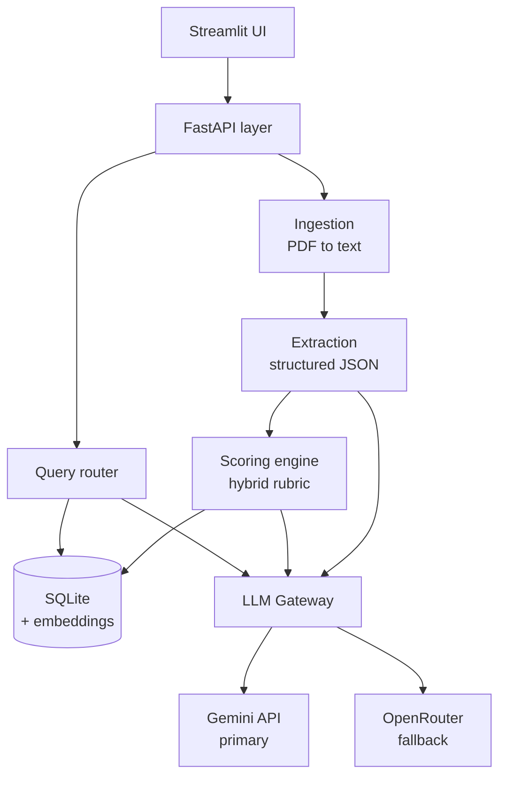
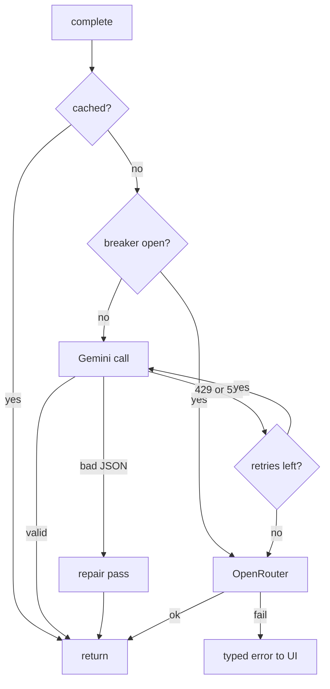
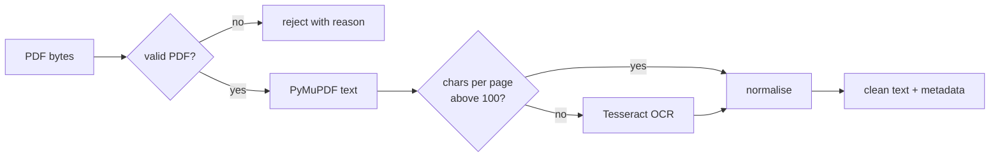
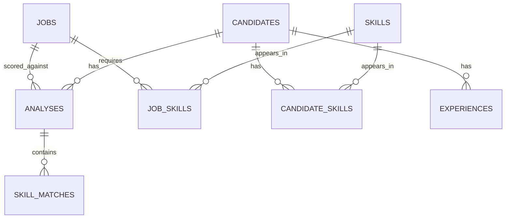

# Architecture

Diagrams copied from `docs/specs.md`; each followed by the one decision it encodes.

## Layers (§2)

Six layers with a Pydantic type at every boundary. The gateway (`app/llm/gateway.py`) is the only
module that holds provider credentials or knows which provider answered; extraction (JD-independent,
cached by resume hash) and analysis (per JD) are two separate LLM calls so a JD change re-scores
without re-parsing.

## Failover (§4.4)

Every call goes cache → Gemini with 1s/2s/4s retry → breaker (5 failures, 60s open, one probe) →
OpenRouter → one JSON repair pass → typed error. Every attempt is a row in `llm_calls`, so the
audit trail is the evidence that failover works, not a log line.

## Parsing (§5)

Text spans are clustered into column bands by x-midpoint and read band-by-band, top to bottom,
which is what keeps two-column resumes from interleaving. OCR runs per page and only when a page
yields fewer than 100 characters; `extraction_method` and `char_count` are stored per candidate.

## Data model (§8)

Skills are normalised into one `skills` table so "who knows Docker" is a join, not a text scan.
Lists only ever read whole (`strengths`, `weaknesses`, `interview_questions`) are JSON columns;
embeddings are float32 BLOBs compared with numpy cosine (sqlite-vec deferred until >1k candidates).
