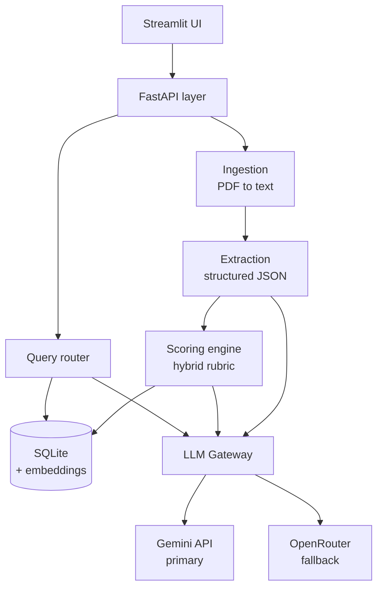
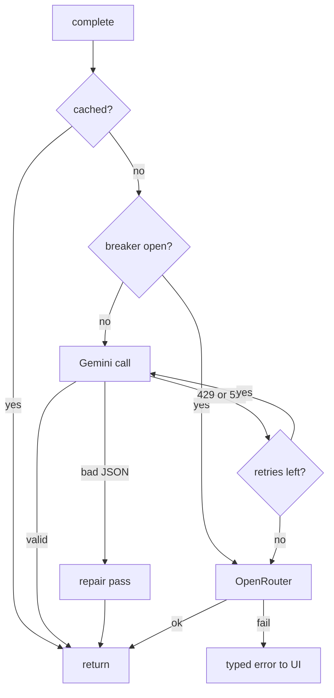
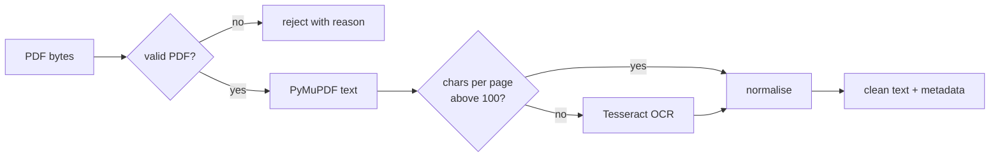
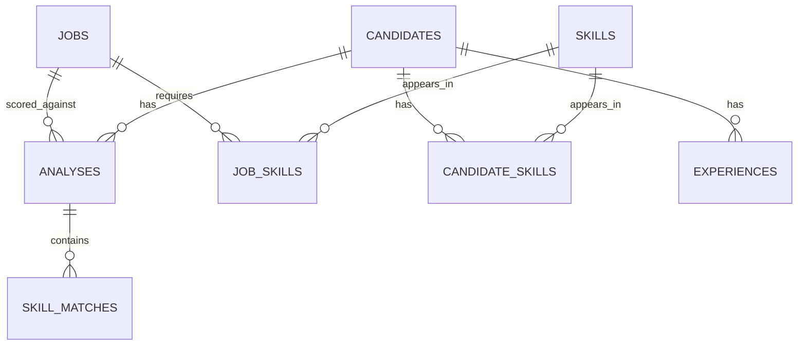

# NipunyaMatch — Engineering Specification

Distilled from `NipunyaMatch-spec.md` (2026-09-18). This document holds the contracts an implementer must satisfy. Rationale and presentation advice live in the original.

## 1. Scope

**Goal.** Ingest resumes (PDF/text) and one job description, score each candidate with an auditable hybrid rubric, persist results, answer recruiter questions in natural language with reasoning and sources.

**Definition of done.** Clone → set one API key → one command → upload five resumes + JD → ranked table within a minute → ask "why is A above B" → grounded answer citing specific skills. All on a clean machine.

**Assumptions**

1. Resumes are text-bearing PDFs in the common case; OCR fallback exists for scans, accuracy not guaranteed.
2. Resumes are English. Non-English parses but scoring degrades.
3. One active JD per session. Schema supports many; UI surfaces one as "current".
4. Batch ≤ 50 resumes. Larger works but UI not designed for it.
5. Total years of experience derived from work-history date ranges; overlapping roles counted once.
6. "Missing skill" = absent from resume text, not absent from candidate.
7. No candidate PII leaves the machine except to the chosen LLM provider.
8. Free-tier LLM quotas are the operating assumption; minimise tokens, cache aggressively.

**In scope:** upload, parse, extract, score, store, rank, query, compare, export. Single-user local deployment. Gemini + OpenRouter with automatic failover.

**Out of scope:** multi-tenant auth, ATS integrations, email outreach, interview scheduling, formats other than PDF/plain text, real-time collaboration, horizontal scaling.

## 2. Architecture



Rules:

- Six layers, each with a typed (Pydantic) boundary to the next.
- The gateway is the only module holding provider credentials or knowing which provider answered.
- Extraction (JD-independent, cacheable) and scoring analysis (JD-dependent) are separate LLM calls.

**Layout**

```
app/
  api/          routes, dependencies, error handlers
  llm/          gateway.py, gemini.py, openrouter.py, prompts/
  parsing/      pdf.py, ocr.py, normalise.py, sections.py
  extraction/   schemas.py, extractor.py, validators.py
  scoring/      components.py, engine.py, skills.py
  query/        classifier.py, handlers/, synthesis.py
  db/           models.py, session.py, migrations/
  ui/           streamlit pages
config/scoring.yaml
tests/          fixtures/ with sample PDFs
docs/architecture.md
README.md
docker-compose.yml
```

Prompts are versioned text files under `app/llm/prompts/`, never inline f-strings.

## 3. Stack

| Layer | Choice |
| --- | --- |
| Language | Python 3.11+ |
| API | FastAPI + Uvicorn |
| Frontend | Streamlit |
| Database | SQLite via SQLAlchemy 2.0 (Postgres switch = one env var) |
| Vector store | `sqlite-vec` extension, same file as relational data |
| Embeddings | `sentence-transformers` all-MiniLM-L6-v2, 384 dims, CPU, local |
| PDF | PyMuPDF primary, `pdfplumber` for tables, `pytesseract` for OCR |
| LLM primary | Google Gemini API, `generateContent` |
| LLM fallback | OpenRouter, OpenAI-style chat completions |
| Validation | Pydantic v2 (LLM response schema + API contract) |
| Testing | pytest + `respx` |
| Packaging | `uv` + Docker |

## 4. LLM gateway

Single public function in `app/llm/gateway.py`:

```python
def complete(prompt: str, schema: type[T], task: LLMTask) -> T
```

Nothing outside `app/llm/` imports a provider client.

### 4.1 Models (config, never hardcoded)

| Task | Model |
| --- | --- |
| Field extraction | `gemini-3.5-flash-lite` |
| Scoring and analysis | `gemini-3.8-flash` |
| Query answering | `gemini-3.5-flash` |
| OpenRouter fallback | `google/gemini-3.8-flash`; `openrouter/free` as zero-cost last resort |
| Embeddings | local MiniLM default; `gemini-embedding-001` optional |

Pin explicit stable IDs. Do not use `-latest` aliases. Gemini 2.0 Flash / 2.0 Flash-Lite are shut down.

### 4.2 API surface

Use `generateContent` (stateless), not the Interactions API, so Gemini and OpenRouter share one adapter shape.

### 4.3 Structured output

One `Model.model_json_schema()` feeds both:

- Gemini: `response_mime_type: "application/json"` + `response_schema`.
- OpenRouter: `response_format: {"type": "json_schema", "json_schema": {"name", "schema", "strict": true}}`.

### 4.4 Failover, in order



1. **Cache first.** Key = `sha256(prompt + model + schema_version)`.
2. **Retry Gemini** on `429 RESOURCE_EXHAUSTED` and 5xx: exponential backoff with jitter, 1s / 2s / 4s, 3 attempts max, honour `retry-after`.
3. **Breaker** trips after 5 consecutive Gemini failures; open for 60s routing straight to OpenRouter; then half-open with one probe.
4. **Fallback to OpenRouter** with the configured model.
5. **Repair pass.** Invalid JSON → one retry with the validation error appended to the prompt. Still invalid → raise typed `ExtractionFailed`; UI shows a per-candidate error row, never a stack trace.
6. **Log every attempt** to `llm_calls` (provider, model, task, prompt_tokens, completion_tokens, latency_ms, attempt, status).

### 4.5 Token discipline

- Resume text truncated to ~12,000 characters before extraction.
- JD embedded once per session and reused.
- Extraction output cached against resume hash; JD change re-scores without re-parse.
- Target: 50-resume batch ≈ 100 LLM calls.

## 5. Ingestion and parsing



1. **Validate.** Magic bytes `%PDF`, page count < 20, size < 10 MB, not encrypted. Reject with a specific message.
2. **Extract.** `page.get_text("blocks")`; cluster blocks by x-midpoint into column bands, sort by band then y. Naive `get_text()` interleaves columns — do not use it.
3. **OCR decision.** < 100 extracted chars on a page → rasterise at 300 DPI, Tesseract. Per page, only where needed.
4. **Normalise.** Collapse whitespace, fix ligatures and smart quotes, strip headers/footers repeated on every page, join mid-sentence line breaks, keep bullet markers.
5. **Section-tag.** Regex over a synonym list for Education, Experience, Skills, Projects, Certifications. Hints only; untagged resumes still parse.

JD PDFs take the same path; pasted JD text skips to normalise.

Store per candidate: `extraction_method` ∈ {`pymupdf`, `pymupdf+ocr`}, `char_count`. Surface both in the UI.

## 6. Candidate analysis contract

### 6.1 Call 1 — extraction (JD-independent)

```python
class WorkExperience(BaseModel):
    company: str
    title: str
    start_date: str | None   # ISO YYYY-MM where derivable
    end_date: str | None     # None means current
    description: str | None

class Education(BaseModel):
    institution: str
    degree: str | None
    field_of_study: str | None
    graduation_year: int | None

class CandidateExtraction(BaseModel):
    name: str | None
    email: EmailStr | None
    phone: str | None
    location: str | None
    linkedin_url: str | None
    skills: list[str]            # verbatim from the resume, deduped
    experience: list[WorkExperience]
    education: list[Education]
    projects: list[str]
    certifications: list[str]
    total_years_experience: float | None
    extraction_confidence: float  # 0-1, the model's own estimate
```

Prompt rules, re-checked in code: never invent a field (return `null`); copy skills verbatim; derive `total_years_experience` from date ranges, overlaps counted once.

### 6.2 Call 2 — JD analysis

```python
class SkillMatch(BaseModel):
    skill: str
    present: bool
    evidence: str | None   # the resume phrase that proves it
    required: bool         # required vs nice-to-have in the JD

class CandidateAnalysis(BaseModel):
    llm_fit_score: int = Field(ge=0, le=100)
    skill_matches: list[SkillMatch]
    strengths: list[str] = Field(max_length=5)
    weaknesses: list[str] = Field(max_length=5)
    summary: str           # 2-3 sentences
    interview_questions: list[str] = Field(min_length=3, max_length=5)
    reasoning: str         # why this score, cited to resume content
```

### 6.3 Post-parse validation

| Check | On failure |
| --- | --- |
| Email matches RFC pattern | Null field, flag `email_uncertain` |
| Phone has 7–15 digits | Keep raw string, flag `phone_uncertain` |
| `graduation_year` in [1950, current year + 6] | Null field |
| Every `evidence` is a substring of resume text (whitespace + case normalised) | Set `present = false`, log hallucination event |
| `total_years_experience` < 60 | Recompute from date ranges |

Hallucination rate = share of claimed skills whose evidence fails the substring check. Reported in README.

### 6.4 Fairness

Name, gender markers, age, photo, address: extracted for display, **withheld from the scoring prompt**. Prompt instructs scoring on skills, experience, education only. Every score decomposes into named components with evidence. Tool assists a human decision; it is not a hiring decision system.

## 7. Scoring

### 7.1 Formula

```
final_score = round(
    0.35 * required_skill_coverage
  + 0.15 * preferred_skill_coverage
  + 0.20 * experience_fit
  + 0.10 * education_fit
  + 0.20 * llm_fit_score
)
```

All components 0–100. Weights in `config/scoring.yaml`. `scoring_version` stored on every `analyses` row. Scores stored, never recomputed at read time.

### 7.2 Components

| Component | Computation |
| --- | --- |
| `required_skill_coverage` | Share of JD required skills matched. Exact = 1.0; alias table (`JS` → `JavaScript`) = 1.0; embedding cosine > 0.75 = 0.8 |
| `preferred_skill_coverage` | Same over nice-to-have list |
| `experience_fit` | 100 if years ≥ JD minimum; linear 40→100 across the band below; capped at 100 (no seniority penalty) |
| `education_fit` | 100 if degree level meets requirement; 70 one level below; 100 if JD states none |
| `llm_fit_score` | Model's holistic 0–100, prompted on project relevance and trajectory |

Skill matching order: exact → alias → embedding. Stop at first hit.

### 7.3 Bands and override

| Score | Recommendation |
| --- | --- |
| 75–100 | Shortlist |
| 50–74 | Consider |
| 0–49 | Reject |

Override: missing more than half of required skills → capped at Consider.

### 7.4 Worked example (must reproduce exactly)

JD: required Python, FastAPI, Docker, PostgreSQL, ML; preferred AWS, Kubernetes; 3+ years; Bachelor's.
Candidate A: Python, FastAPI, TensorFlow, scikit-learn, PostgreSQL; 4 years; B.Tech; no Docker.

| Component | Value | Working |
| --- | --- | --- |
| Required coverage | 80 | 4/5 (ML via TensorFlow at 0.81 cosine); Docker absent |
| Preferred coverage | 0 | Neither AWS nor Kubernetes |
| Experience fit | 100 | 4 ≥ 3 |
| Education fit | 100 | B.Tech meets Bachelor's |
| LLM fit | 78 | |
| **Final** | **72** | 28.0 + 0.0 + 20.0 + 10.0 + 15.6 |

Recommendation: Consider.

## 8. Database



| Table | Columns | Notes |
| --- | --- | --- |
| `jobs` | `id`, `title`, `raw_text`, `min_years`, `education_level`, `embedding`, `created_at` | One row per JD |
| `candidates` | `id`, `name`, `email`, `phone`, `location`, `total_years_experience`, `resume_hash`, `extraction_method`, `char_count`, `raw_text`, `created_at` | `resume_hash` unique; re-upload updates |
| `skills` | `id`, `canonical_name`, `embedding` | Global deduped vocabulary |
| `candidate_skills` | `candidate_id`, `skill_id`, `raw_mention`, `evidence` | |
| `job_skills` | `job_id`, `skill_id`, `is_required` | |
| `experiences` | `id`, `candidate_id`, `company`, `title`, `start_date`, `end_date`, `description` | |
| `analyses` | `id`, `candidate_id`, `job_id`, `final_score`, `required_skill_coverage`, `preferred_skill_coverage`, `experience_fit`, `education_fit`, `llm_fit_score`, `recommendation`, `summary`, `reasoning`, `strengths` (JSON), `weaknesses` (JSON), `interview_questions` (JSON), `scoring_version`, `created_at` | Unique (`candidate_id`, `job_id`) |
| `skill_matches` | `analysis_id`, `skill_id`, `present`, `required`, `evidence` | |
| `llm_calls` | `id`, `provider`, `model`, `task`, `prompt_tokens`, `completion_tokens`, `latency_ms`, `attempt`, `status` | Audit trail |

```sql
CREATE UNIQUE INDEX idx_cand_hash     ON candidates(resume_hash);
CREATE UNIQUE INDEX idx_analysis_pair ON analyses(candidate_id, job_id);
CREATE INDEX idx_analysis_score       ON analyses(job_id, final_score DESC);
CREATE INDEX idx_cs_skill             ON candidate_skills(skill_id);
CREATE INDEX idx_cs_candidate         ON candidate_skills(candidate_id);
CREATE INDEX idx_exp_candidate        ON experiences(candidate_id);
```

Policy: lists only ever read whole (`strengths`, `weaknesses`, `interview_questions`) are JSON columns; anything filtered or joined is a table. Embeddings live in `sqlite-vec` virtual tables in the same file.

## 9. Natural language query layer

One LLM call classifies to intent + typed params. Typed handlers, not text-to-SQL.

| Intent | Example | Handler |
| --- | --- | --- |
| `top_n` | Show me the top 5 candidates | `ORDER BY final_score DESC LIMIT n` |
| `filter_skill` | Which candidates know Python / are missing Docker | Join `candidate_skills` with `has`/`missing` flag |
| `filter_attribute` | Candidates with more than 2 years experience | Comparison on whitelisted numeric column |
| `compare` | Compare Candidate A and Candidate B | Fetch both analyses, diff components |
| `explain_ranking` | Why is X ranked higher than Y | Diff components, narrate largest gaps |
| `recommend` | Recommend the best candidate for interview | Top-scored + reasoning |
| `semantic` | anything else | Embedding search over summaries and evidence |

Unparseable classifier output → `semantic`.

**Guardrails.** All SQL parameterised, column names whitelisted, query-path connection read-only, result sets capped at 50 rows, synthesis prompt receives only retrieved rows and must say "not in data" rather than guess.

**Synthesis.** For `explain_ranking` and `compare`, component diffs are computed in Python and passed as structured facts; numbers in the answer are arithmetic, not LLM recall. Every answer carries candidate IDs.

## 10. API

| Method | Path | Purpose |
| --- | --- | --- |
| `POST` | `/api/jobs` | Create job from PDF upload or pasted text |
| `GET` | `/api/jobs/{id}` | Job detail with parsed required/preferred skills |
| `POST` | `/api/jobs/{id}/resumes` | Upload 1–50 PDFs, returns batch id |
| `GET` | `/api/batches/{id}` | Batch progress: per-file status and errors |
| `GET` | `/api/jobs/{id}/candidates` | Ranked list; params `min_score`, `skill`, `limit` |
| `GET` | `/api/candidates/{id}` | Full profile + analysis for current job |
| `POST` | `/api/jobs/{id}/query` | NL question → answer + sources |
| `POST` | `/api/jobs/{id}/rescore` | Re-run scoring with current weights, no re-parse |
| `GET` | `/api/jobs/{id}/export` | CSV or XLSX of ranked table |
| `GET` | `/api/health` | Provider reachability and breaker state |

**Query response**

| Field | Type |
| --- | --- |
| `answer` | string |
| `intent` | enum |
| `sources` | list of `{candidate_id, name, score}` |
| `latency_ms` | int |
| `provider_used` | `gemini` \| `openrouter` |

**Processing.** Upload returns immediately with batch id. Parsing + scoring run in FastAPI `BackgroundTasks` behind a semaphore of 4 concurrent LLM calls. UI polls every 2s. One failed resume never blocks the batch.

**Errors** — body always `{code, message, retry_after?}`; message written for recruiters.

| Status | Code | When |
| --- | --- | --- |
| 400 | `INVALID_PDF` | Corrupt, encrypted, or over 20 pages |
| 413 | `FILE_TOO_LARGE` | Over 10 MB |
| 422 | `EXTRACTION_FAILED` | Both providers returned unparseable output |
| 429 | `QUOTA_EXHAUSTED` | Both providers rate-limited |
| 503 | `NO_PROVIDER` | No API key, or both unreachable |

## 11. UI (Streamlit)

Shared sidebar: active job, candidate count, provider status dot.

1. **Setup** — paste/upload JD; parsed required/preferred skills as editable chips; drag-and-drop resumes with running file list.
2. **Processing** — live table per file (filename, status, extraction method, error); progress bar; running LLM call count; failures stay visible with retry.
3. **Candidates** — sortable table (name, score, recommendation, matched/missing counts, years); colour-banded score; expandable row with component breakdown, strengths/weaknesses, summary, evidence-linked skills, interview questions; filters for min score, required skill, years; export button.
4. **Assistant** — chat; prose + source chips linking to candidates; provider shown; four starter-question buttons.

**Required states:** no job yet; job but no resumes; batch in progress; all resumes failed; no API key configured; quota exhausted mid-batch. Each has a specific message and next action.

## 12. Configuration

```
GEMINI_API_KEY=            # required for the primary path
OPENROUTER_API_KEY=        # optional; without it there is no fallback
GEMINI_MODEL_EXTRACT=gemini-3.5-flash-lite
GEMINI_MODEL_ANALYZE=gemini-3.8-flash
GEMINI_MODEL_QUERY=gemini-3.5-flash
OPENROUTER_MODEL=google/gemini-3.8-flash
DATABASE_URL=sqlite:///./data/recruiter.db
EMBEDDING_BACKEND=local    # local | gemini
MAX_CONCURRENT_LLM=4
LOG_LEVEL=INFO
```

Validated at startup by a Pydantic `Settings` class. Missing `GEMINI_API_KEY` fails fast naming the variable and where to get a key. Ship `.env.example` with every variable, no values. `.env` in `.gitignore`.

Run paths: `docker compose up` (documented) and `uv sync && uv run uvicorn app.main:app`. `make seed` loads sample JD + 12 fixture resumes.

## 13. Testing

No network, no API key. Both providers mocked with `respx`.

| Layer | Tested | Tool |
| --- | --- | --- |
| Parsing | Fixture PDFs incl. two-column, scanned, table-heavy; substring asserts | pytest |
| Gateway | Retry counts, breaker transitions, failover, cache hits, repair pass | `respx` scripted 429s |
| Schemas | Malformed output, missing fields, out-of-range scores | Pydantic round-trip |
| Scoring | Worked example reproduces exactly; weight changes move scores | pytest parametrised |
| Query | All ten brief questions against seeded DB; assert intent + rows | pytest |
| Integration | Upload → answer with mocked LLM | FastAPI `TestClient` |

**Golden set:** 1 JD + 12 resumes with hand-labelled extractions and a human ranking. Report: per-field extraction accuracy (name, email, phone, skills), hallucination rate, Spearman ranking correlation. State the wide error bars.

**Gates:** `ruff`; `mypy --strict` on `app/llm` and `app/scoring`; `pytest --cov` ≥ 70% on business logic. GitHub Actions on push.

**Commits:** conventional commits, one per meaningful unit, tag at each phase boundary.

## 14. Known limitations

1. Scanned resumes depend on OCR quality.
2. Non-English resumes score unreliably.
3. Rare technology mentioned once may miss alias + embedding matching.
4. Years of experience wrong when dates absent or overlapping contracts ambiguous.
5. LLM component varies slightly between runs at temperature 0; deterministic 80% keeps rankings stable.
6. Single-user, single-machine; no auth, no concurrent-writer safety.
7. Evaluation set is 12 resumes; wide error bars.
